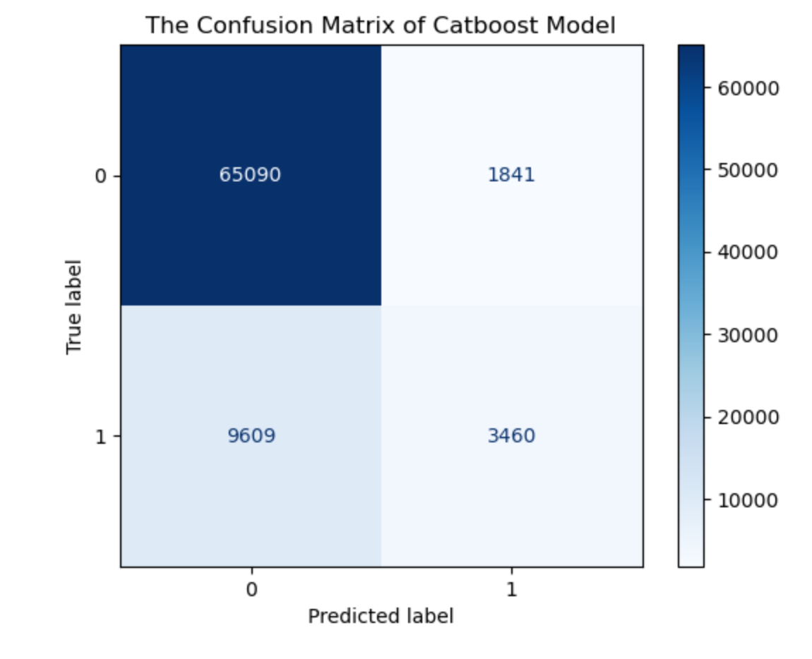
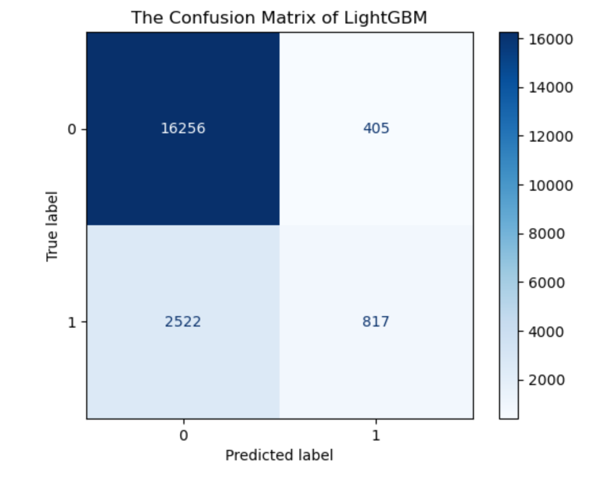

# Credit Card Fraud Detection Based on Labeled Datasets

---

### Contents:

- [Problem Statement](#Problem-Statement)
- [Background](#Background)
- [Datasets](#Datasets)
- [Exploratory Data Analysis (EDA) and Preprocessing](#Exploratory-Data-Analysis-(EDA)-and-Preprocessing)
    - [Contribution of fraud flags](#Contribution-of-fraud-flags)
    - [Number of Frauds Based on Different Factors](#Number-of-Frauds-Based-on-Different-Factors)
- [Predicting Frauds Based on Tree Based Models](#Predicting-Frauds-Based-on-Tree-Based-Models)
    - [CatBoost Model](#CatBoost-Model)
    - [LightGBM Model](#LightGBM-Model)
- [Conclusions](#Conclusions)
- [Recommendations](#Recommendations)

---

### Problem Statement

Developing a robust credit card fraud detection system using CatBoost and LightGBM, this project endeavours to leverage historical transactional data encompassing labelled instances of fraudulent and legitimate transactions. The key objective is to harness the power of tree-based machine learning algorithms to discern intricate patterns within the data and accurately distinguish fraudulent transactions from genuine ones.

---

### Background

Credit card fraud remains a critical concern in the financial sector, posing significant financial risks to consumers and institutions. The proliferation of digital transactions has led to increased susceptibility to fraudulent activities. Traditional rule-based systems often struggle to adapt to evolving fraud tactics. Consequently, there is a pressing need for sophisticated machine learning models capable of swiftly detecting and preventing fraudulent credit card transactions. Leveraging historical transactional data that includes labelled instances of fraudulent and legitimate transactions, this project aims to employ tree-based machine learning models, specifically CatBoost and LightGBM, to develop an effective fraud detection system.

---

### Datasets

The raw dataset [Synthetic Credit Card Transaction](https://datafabrica.info/products/synthetic-credit-card-transaction-data?variant=45263134621986) is provided from [DataFabrica](https://datafabrica.info/). The data contains synthetic credit card transaction amounts, credit card information, transaction IDs and more.

|Feature|Type|Description|
|---|---|---|
|cardholder_name|Object|The individual's name associated with the card used for the transaction.|
|card_number|Numeric(Discrete)|A unique number linked to the credit card utilized in the transaction. Note: Sensitive data; handle with privacy measures.|
|card_type|Object(Cetagorical)|The brand or type of the credit card employed (e.g., Visa, Mastercard, American Express).|
|merchant_name|Object|The title of the merchant or business where the transaction took place.|
|merchant_category|Object(Cetagorical)|The sector or industry classification of the merchant (e.g., retail, dining, entertainment).|
|merchant_state|Object(Cetagorical)|The state in which the merchant is situated.|
|merchant_city|Object(Cetagorical)|The city where the merchant operates.|
|transaction_amount|Numeric(Continuous)|The monetary value spent during the transaction.|
|merchant_category_code|Object(Cetagorical)|An alphanumeric or numerical code denoting the specific category of the merchant according to a predefined system.|
|fraud_flag|Numeric(Discrete)|A binary indicator marking the transaction as fraudulent (1) or non-fraudulent (0).|

---

### Exploratory Data Analysis (EDA) and Preprocessing

**Upon initial examination of the dataset, the following observations were made:**

- The distribution of transactions is uniform across merchants.
- The distribution of transactions is uniform across merchant categories.
- The distribution of transactions is uniform across states.
- **Portland**, **Fargo**, and **Columbia** have more transactions (over 2000) compared to other states (1000).

### Contribution of fraud flags

The data shows that high value transactions have a higher likelihood of being fraudulent. However, since the majority of transactions involve amounts less than 50K, relying solely on transaction amounts for fraud detection may not be effective.

### Number of Frauds Based on Different Factors

**Number of Frauds in Each Merchant Category**

According to the plot, it seems that the majority of fraud cases are occurring in the Fine Dining category. However, the chart doesn't reveal any significant variation among the different merchant categories. Also, the limited number of categories displayed on the chart doesn't allow us to determine which category is associated with a higher number of fraudulent transactions in more details.

&nbsp; &nbsp; &nbsp; &nbsp;

**Number of Frauds By Card Type**

Based on the plot, American Express credit cards have the highest incidence of fraud.

&nbsp; &nbsp; &nbsp; &nbsp;

**Number of Frauds in Each State**

According to the plot, Alabama, Nevada, and Delaware have the highest number of fraud cases.

&nbsp; &nbsp; &nbsp; &nbsp;

**Number of Frauds in Each City**

Based on the plot, the cities with the highest number of frauds are Birmingham, Montgomery, Henderson, Las Vegas, Wilmington, and Dover.

---

### Predicting Frauds Based on Tree Based Models

In the model development phase of our fraud prediction project, the journey begins with an insightful Exploratory Data Analysis (EDA). Through this process, we discerned the significance of certain features such as cardholder names, cities, states, and merchant types about fraudulent transactions. These observations guided our model development strategy, indicating that these categorical features play pivotal roles in distinguishing fraudulent from legitimate transactions.

Our choice to employ CatBoost and LightGBM stems from their exceptional abilities to handle categorical variables efficiently without the need for extensive preprocessing. These tree-based models offer robustness against overfitting, thanks to their regularization parameters, and they leverage boosting algorithms to progressively improve predictive accuracy. By utilizing these models, we aim to harness their inherent strengths in handling complex categorical features while enhancing predictive performance through iterative training, hyperparameter tuning, and meticulous evaluation using metrics such as precision, recall, F1-score, AUC-ROC, and the Confusion Matrix. This strategic approach aligns with our goal to develop reliable and accurate predictive models capable of discerning fraudulent activities within our dataset, ultimately contributing to robust fraud detection mechanisms.

### CatBoost Model

CatBoost, an advanced gradient boosting algorithm, stands out in fraud detection with its exceptional capability to handle categorical features seamlessly. Leveraging ordered boosting and innovative strategies like oblivious trees, it minimizes overfitting while boosting accuracy. CatBoost utilizes the logarithm of the target variable in its optimization, aiding robustness against outliers and enabling accurate predictions even with limited data. Its inherent support for categorical variables eliminates the need for extensive preprocessing, as it inherently encodes categorical data by adopting the method of Ordered Target Encoding. This unique encoding technique ensures minimal data leakage, contributing to enhanced model performance and interpretability. With its efficient handling of high-cardinality categorical variables and built-in features for fast computation, CatBoost serves as a reliable and powerful tool in the realm of fraud detection and classification tasks. The following confusion matrix visualizes the number of correct and incorrect predictions for each class, enabling an assessment of the model's performance.

|Metric|Score|
|---|---|
|Accuracy|0.8568|
|Precision|0.6527|
|Sensitivity|0.2647|
|Specifity|0.9724|
|F1|0.3767|

#### Feature Importance with The CatBoost Model

Feature Importance is a crucial machine learning tool that helps identify key drivers that impact model predictions. It aids in feature selection and understanding the most significant variables that contribute to the model's overall predictive power.

**The plot illustrates the significance of transaction amount, merchant city and card number in detecting fraud.**

### LightGBM Model

LightGBM, a gradient boosting framework, stands as a robust model for fraud detection owing to its exceptional performance and efficiency in handling large-scale datasets. It features a unique histogram-based approach to tree building, enhancing computational speed while accommodating extensive categorical data, a crucial asset in fraud detection tasks. By employing an ensemble of decision trees and advanced optimization techniques like leaf-wise growth, LightGBM minimizes loss functions efficiently, making it adept at capturing intricate patterns inherent in fraudulent activities. Its tunable parameters including learning rate, number of leaves, and feature fraction facilitate fine-tuning for optimal performance tailored to fraud detection tasks. The following confusion matrix visualizes the number of correct and incorrect predictions for each class, enabling an assessment of the model's performance.

|Metric|Score|
|---|---|
|Accuracy|0.8536|
|Precision|0.6685|
|Sensitivity|0.2446|
|Specifity|0.9756|
|F1|0.3582|

---

### Conclusions

* High-value transactions are more likely to be fraudulent, but relying solely on transaction amounts may not be effective in detecting fraud.

* American Express credit cards have the highest incidence of fraud.

* The CatBoost model outperformed the LightGBM model in fraud detection with an accuracy of 0.8572, precision of 0.6540, and F1 Score of 0.3805.

* Features such as transaction amount, merchant location, and card number played an important role in detecting fraud using the CatBoost model.

---

### Recommendations

* We should further optimize model parameters and hyperparameters to maximize performance metrics such as accuracy, precision, and F1 Score. This iterative process can enhance the model's ability to distinguish between genuine and fraudulent transactions accurately.

* We should consider implementing ensemble methods that combine predictions from multiple models, including CatBoost and LightGBM, to leverage the strengths of each model and improve overall detection accuracy.

* We should implement a real-time fraud monitoring system that continuously analyzes incoming transactions, flagging suspicious activities promptly for manual review or intervention. This proactive approach can mitigate potential losses by swiftly identifying and addressing fraudulent attempts.
